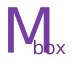
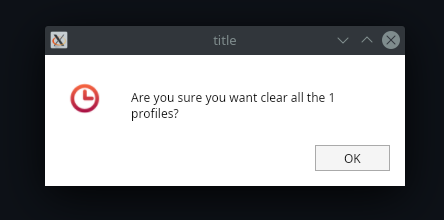
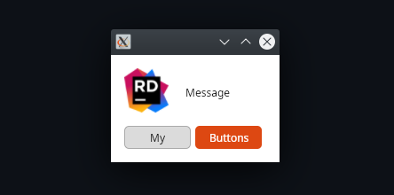
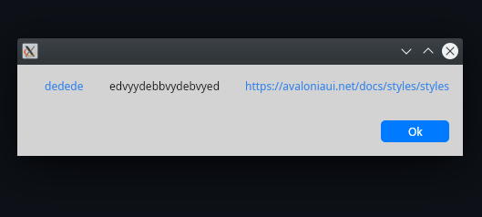

# MessageBox.Avalonia

Messagebox for AvaloniaUI





To start you should install MessageBox.Avalonia NuGet package 
>   dotnet add package MessageBox.Avalonia 

[](https://www.nuget.org/packages/MessageBox.Avalonia/1.1.0)
or download this repo.

---

The easiest way to get started is this:



```cs 
var messageBoxStandardWindow = MessageBox.Avalonia.MessageBoxManager
  .GetMessageBoxStandardWindow("title", "Lorem ipsum dolor sit amet, consectetur adipiscing elit, sed...");
messageBoxStandardWindow.Show();
```

---

Or this, with default buttons from the default `ButtonEnum`:


```cs
var msBoxStandardWindow = MessageBox.Avalonia.MessageBoxManager
    .GetMessageBoxStandardWindow(new MessageBoxStandardParams{
        ButtonDefinitions = ButtonEnum.OkAbort,
        ContentTitle = "Title",
        ContentMessage = "Message",
        Icon = Icon.Plus,
        Style = Style.UbuntuLinux
    });
msBoxStandardWindow.Show();
```

---

Or like this, with custom buttons:


```cs
var messageBoxCustomWindow = MessageBox.Avalonia.MessageBoxManager
    .GetMessageBoxCustomWindow(new MessageBoxCustomParams {
        Style = Style.UbuntuLinux,
        ContentMessage = "Message",
        ButtonDefinitions = new [] {
            new ButtonDefinition {Name = "My"},
            new ButtonDefinition {Name = "Buttons", Type = ButtonType.Colored}
        }
    });
messageBoxCustomWindow.Show();
```

---

And you may use your own images:



```cs
 var messageBoxCustomWindow = MessageBox.Avalonia.MessageBoxManager
                .GetMessageBoxCustomWindow(new MessageBoxCustomParamsWithImage
                {
                    Style = Style.UbuntuLinux,
                    ContentMessage = "Message",
                    Icon = new Bitmap("./icon-rider.png"),
                    ButtonDefinitions = new[] {
                        new ButtonDefinition {Name = "My"},
                        new ButtonDefinition {Name = "Buttons", Type = ButtonType.Colored}
                    },
                    WindowStartupLocation = WindowStartupLocation.CenterOwner
                });
 messageBoxCustomWindow.Show();
```
---

Also you may use hyperlink boxes:




```cs
 var messageBoxCustomWindow = MessageBox.Avalonia.MessageBoxManager.GetMessageBoxHyperlinkWindow(new MessageBoxHyperlinkParams()
            {
                CanResize = true,
                Style = MessageBoxAvaloniaEnums.Style.MacOs,
                HyperlinkContentProvider = new[]{
                    new HyperlinkContent { Alias = "dedede         ", Url = "https://avaloniaui.net/docs/styles/styles" },
                    new HyperlinkContent { Alias="edvyydebbvydebvyed         "},
                    new HyperlinkContent { Url= "https://avaloniaui.net/docs/styles/styles" }
                },
                WindowStartupLocation = WindowStartupLocation.CenterScreen,
                ButtonDefinitions = MessageBoxAvaloniaEnums.ButtonEnum.Ok
            });
messageBoxCustomWindow.Show();
```

---

**Powered by**

<a href="https://www.jetbrains.com/?from=ABC">

</a>
