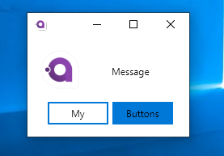

# MessageBox.Avalonia

Messagebox for AvaloniaUI
for 0.9





To start you should install MessageBox.Avalonia Nuget package 
>   dotnet add package MessageBox.Avalonia 

[](https://www.nuget.org/packages/MessageBox.Avalonia/0.9.0)
or download this repo.

[](https://github.com/CreateLab/MessageBox.Avalonia/wiki) - here you can find all Api.


The easiest way is:


```cs 
var messageBoxStandardWindow = MessageBox.Avalonia.MessageBoxManager.GetMessageBoxStandardWindow("title","orem ipsum dolor sit amet, consectetur adipiscing elit, sed...");
messageBoxStandardWindow.Show();
```

or this with defautlt buttons from enum:


```cs
            var msBoxStandardWindow = MessageBox.Avalonia.MessageBoxManager.GetMessageBoxStandardWindow(new MessageBoxStandardParams{
                ButtonDefinitions = ButtonEnum.OkAbort,
                ContentTitle = "Title",
                ContentMessage = "Message",
                Icon = Icon.Plus,
                Style = Style.UbuntuLinux
            });
            msBoxStandardWindow.Show();
```

or like this, with custom buttons:


```cs
            var messageBoxCustomWindow = MessageBox.Avalonia.MessageBoxManager.GetMessageBoxCustomWindow(new MessageBoxCustomParams {
                Style = Style.UbuntuLinux,
                ContentMessage = "Message",
                ButtonDefinitions = new []{new ButtonDefinition{Name = "My"},new ButtonDefinition{Name = "Buttons",Type = ButtonType.Colored} }
            });
            messageBoxCustomWindow.Show();
```
**Powered by**


**Usages:**

[Lacmus](https://github.com/lizaalert/lacmus)

[SQRLDotNetClient](https://github.com/sqrldev/SQRLDotNetClient)

[OpenTabletDriver](https://github.com/InfinityGhost/OpenTabletDriver/tree/c4d823a11824abec3fb0f6d4f7182610aba5c9d8)

