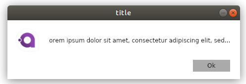
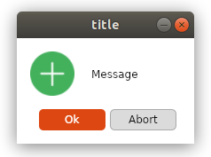
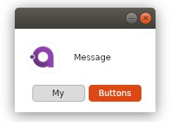

# MessageBox.Avalonia

Messagebox for AvaloniaUI

To start you shold install MessageBox.Avalonia Nuget package 
>   dotnet add package MessageBox.Avalonia 

[nuget.org](https://www.nuget.org/packages/MessageBox.Avalonia/)
or download this repo.


( feature Cntr+C bind to copy ContentMessage to clipboard)


But you can create more powerfull widows, like this:



```cs
var mbx  = new MessageBox.Avalonia.MessageBoxWindow("title","orem ipsum dolor sit amet, consectetur adipiscing elit, sed...");
    mbx.Show();
```

or this with defautlt buttons from enum:



```cs
  var msgbox = new MessageBox.Avalonia.MessageBoxWindow(new MessageBoxParams
            {
                Button = ButtonEnum.OkAbort,
                ContentTitle = "title",
                ContentMessage = "Message",
                Icon = Icon.Plus,
                Style = Style.UbuntuLinux
            });
            msgbox.Show();
```

or like this, with custom buttons:



```cs
   var m1 = MessageBox.Avalonia.MessageBoxWindow.CreateCustomWindow(new MessageBoxCustomParams
            {
                Style = Style.UbuntuLinux,
                ContentMessage = "Message",
                ButtonDefinitions = new []{new ButtonDefinition{Name = "My"},new ButtonDefinition{Name = "Buttons",Type = ButtonType.Colored} }
            });
            m1.Show();
```

