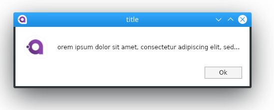
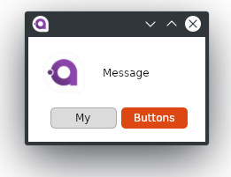

# MessageBox.Avalonia

Messagebox for AvaloniaUI
for 0.9 preview
To start you shold install MessageBox.Avalonia Nuget package 
>   dotnet add package MessageBox.Avalonia 

[nuget.org](https://www.nuget.org/packages/MessageBox.Avalonia/)
or download this repo.

 - here you can find all Api.


The easiest way is:



```cs 
var messageBoxStandardWindow = MessageBox.Avalonia.MessageBoxManager.GetMessageBoxStandardWindow("title","orem ipsum dolor sit amet, consectetur adipiscing elit, sed...");
messageBoxStandardWindow.Show();
```

or this with defautlt buttons from enum:


```cs
            var msBoxStandardWindow = MessageBox.Avalonia.MessageBoxManager.GetMessageBoxStandardWindow(new MessageBoxStandardParams{
                ButtonDefinitions = ButtonEnum.OkAbort,
                ContentTitle = "Title",
                ContentMessage = "Message",
                Icon = Icon.Plus,
                Style = Style.UbuntuLinux
            });
            msBoxStandardWindow.Show();
```

or like this, with custom buttons:



```cs
            var messageBoxCustomWindow = MessageBox.Avalonia.MessageBoxManager.GetMessageBoxCustomWindow(new MessageBoxCustomParams {
                Style = Style.UbuntuLinux,
                ContentMessage = "Message",
                ButtonDefinitions = new []{new ButtonDefinition{Name = "My"},new ButtonDefinition{Name = "Buttons",Type = ButtonType.Colored} }
            });
            messageBoxCustomWindow.Show();
```

