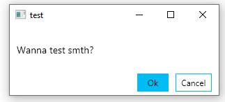

# MessageBox.Avalonia

Messagebox for AvaloniaUI

To start you shold install MessageBox.Avalonia Nuget package 
>   dotnet add package MessageBox.Avalonia 

[nuget.org](https://www.nuget.org/packages/MessageBox.Avalonia/)
or download this repo.

Class MessageBox has 4 static metods to show msgBox (like wpf).
Dialog show, show to result, native show and just show

Easyest method to show is :

` MessageBox.Show("test","MyTest");`

Just set title and content, but you can choose what buttons you wanna show and what Icon (only BitMap)

