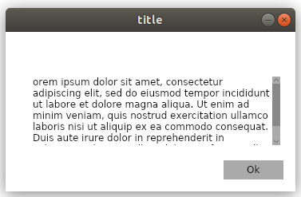
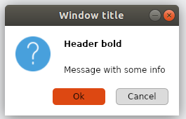
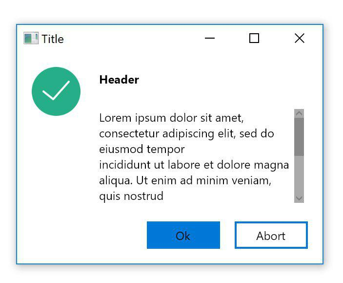

# MessageBox.Avalonia

Messagebox for AvaloniaUI(MVVM template)

To start you shold install MessageBox.Avalonia Nuget package 
>   dotnet add package MessageBox.Avalonia 

[nuget.org](https://www.nuget.org/packages/MessageBox.Avalonia/)
or download this repo.


( feature Cntr+C bind to copy ContentMessage to clipboard)

Easyest method to show is :
```cs
MessageBoxManager.Instance.Show("title","orem ipsum dolor sit amet, consectetur adipiscing elit, sed...");
```





But you can create more powerfull widows, like this:



or this:




<h1>API:</h1>

<h2>DTO:</h2>
(Data Transfer Object)

<h3>MessageBoxParams:</h3>

```cs
public class MessageBoxParams
    {
        public bool CanResize { get; set; } = false;
        public string ContentTitle { get;  set; } = string.Empty;
        public string ContentHeader { get;  set; } = null;
        public string ContentMessage { get;  set; } =string.Empty;
        public int? MaxWidth { get; set; } = null;
        public Button Button { get; set; } = Button.Ok;
        public Icon Icon { get; set; } = Icon.Avalonia;
        public Window ParentWindow { get; set; } = null;
        public Bitmap WindowIcon { get; set; } = null;
        public Style Style { get; set; } = Style.None;
    }
```

<h2>Enums:</h2>

<h3>Button:</h3>

```cs
 public enum Button
    {
        Ok,
        YesNo,
        OkCancel,
        OkAbort,
        YesNoCancel,
        YesNoAbort
    }
```


<h3>MessageBoxResult:</h3>

```cs
  public enum MessageBoxResult
    {
        None,
        Ok,
        Yes,
        No,
        Cancel,
        Abort
    }

```

<h3>Icon:</h3>

```cs
 public enum Icon
    {
        None,
        Success,
        Error,
        Info,
        Warning,
        Avalonia,
        Battery,
        Bluetooth,
        Database,
        Forbidden,
        Lock,
        Plus,
        Setting,
        Speaker,
        Stop,
        Stopwatch,
        Wifi
    }

```
<h3>Style:</h3>

```cs
 public enum Style
    {
        None,
        Windows,
        MacOs,
        UbuntuLinux,
        MintLinux,
        DarkMode
    }
```


<h2>Public methods:</h2>

<h3>Show:</h3>

Displays a message box 

```cs
 public Task<MessageBoxResult> Show(string title, string text, Button button = Button.Ok,
            Icon icons = Icon.None, Style style = Style.None)
```


<h4>Parameters:</h4>
<b>title</b> - window's title.


<b>text</b> - the text to display in the message box.

<b>buttons</b> - one of the **Button** enum values that specifies which buttons to display in the message box.
                 Default value is **Button.Ok**
                 
<b>Icon</b> - one of the **Icon** enum values that specifies which icon to display in the message box.
                Default value is **Icon.None**
                
<b>Style</b> - one of the **Style** enum values that specifies which style to display.
                Default value is **Style.None**

<h4>Returns:</h4>
One of the <b>MessageBoxResult</b> values.

<h3>ShowDialog:</h3>

Displays a message box as dialog window .

```cs
  public Task<MessageBoxResult> ShowDialog(Window parentWindow, string title, string text,
            Button button = Button.Ok,
            Icon icons = Icon.None, Style style = Style.None)

```


<h4>Parameters:</h4>


<b>parentWindow</b> - the window, which is parent for this massagebox.


<b>title</b> - window's title.

<b>text</b> - the text to display in the message box.

<b>buttons</b> - one of the **Button** enum values that specifies which buttons to display in the message box.
                 Default value is **Button.Ok**
                 
<b>Icon</b> - one of the **Icon** enum values that specifies which icon to display in the message box.
                Default value is **Icon.None**
                
<b>Style</b> - one of the **Style** enum values that specifies which style to display.
                Default value is **Style.None**

<h4>Returns:</h4>
One of the <b>MessageBoxResult</b> enum values.

<h3>Show(DTO):</h3>

Displays a message box , which u can castomise with all  MessageBoxParams fields (ignore parent window)

```cs
 public Task<MessageBoxResult> Show(MessageBoxParams @params)
```

<h4>Returns:</h4>
One of the <b>MessageBoxResult</b> enum values.


<h3>ShowDialog(DTO):</h3>

Displays a message box as dialog window , which u can castomise with all  MessageBoxParams fields

```cs
 public Task<MessageBoxResult> Show(MessageBoxParams @params)
```

<h4>Returns:</h4>
One of the <b>MessageBoxResult</b> enum values.
