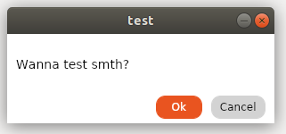

# MessageBox.Avalonia

Messagebox for AvaloniaUI

To start you shold install MessageBox.Avalonia Nuget package 
>   dotnet add package MessageBox.Avalonia 

[nuget.org](https://www.nuget.org/packages/MessageBox.Avalonia/)
or download this repo.

Class MessageBox has 4 static metods to show msgBox (like wpf).
Dialog show, show to result, native show and just show

Easyest method to show is :

` MessageBox.ShowForResult("test","Wanna test smth?",MessageBox.MessageBoxButtons.OkCancel);`

Just set title and content, but you can choose what buttons you wanna show and what Icon (only BitMap)



[create an anchor](#api)
<h1>API:</h1>

<h2>Enums:</h2>

<h3>MessageBoxButtons:</h3>

```
enum MessageBoxButtons
{
    Ok,
    OkCancel,
    YesNo,
    YesNoCancel
}
```


<h3>MessageBoxResult:</h3>

```
enum MessageBoxResult
{
    Ok,
    Cancel,
    Yes,
    No
}
```

<h2>Public methods:</h2>

<h3>ShowForResult:</h3>

Displays a message box with the specified title, text, buttons.

```
public static Task<MessageBoxResult> ShowForResult(string title, string text, 
                                                MessageBoxButtons buttons = MessageBoxButtons.Ok, 
                                                WindowSize windowSize = null, Bitmap bitmap = null)
```


<h4>Parameters:</h4>
<b>title</b> - window's title.


<b>text</b> - the text to display in the message box.

<b>buttons</b> - one of the **MessageBoxButtons** enum values that specifies which buttons to display in the message box.
                 Default value is MessageBoxButtons.Ok.

<b>windowSize</b> - set window size, if it's null (that's default value), set as 300x200.

<b>bitmap</b> - set icon of window.

<h4>Returns:</h4>
One of the <b>MessageBoxResult</b> values.

<h3>ShowDialog:</h3>

Displays a message box as dialog window .

```
 public static Task<MessageBoxResult> ShowDialog(string title, string text, Window parent,
            MessageBoxButtons buttons = MessageBoxButtons.Ok, WindowSize windowSize = null, Bitmap bitmap = null)

```


<h4>Parameters:</h4>
<b>title</b> - window's title.


<b>text</b> - the text to display in the message box.

<b>parent</b> - the window, which is parent for this massagebox.

<b>buttons</b> - one of the **MessageBoxButtons** enum values that specifies which buttons to display in the message box.
                 Default value is MessageBoxButtons.Ok.
                 
<b>windowSize</b> - set window size, if it's null (that's default value), set as 300x200.

<b>bitmap</b> - set icon of window.

<h4>Returns:</h4>
One of the <b>MessageBoxResult</b> enum values.

<h3>Show:</h3>

Displays a message box with ok button, wich doesn't return result of click.

```
 public static void Show(string title, string text, WindowSize windowSize = null, Bitmap bitmap = null)
```


<h4>Parameters:</h4>
<b>title</b> - window's title.


<b>text</b> - the text to display in the message box.


<b>windowSize</b> - set window size, if it's null (that's default value), set as 300x200.

<b>bitmap</b> - set icon of window.

