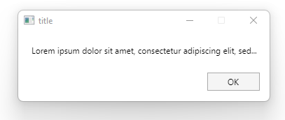

# MessageBox.Avalonia

Messagebox for AvaloniaUI
Now support all platforms as Xplat template


To start you should install MessageBox.Avalonia NuGet package 
>   dotnet add package MessageBox.Avalonia 

[](https://www.nuget.org/packages/MessageBox.Avalonia/)
or download this repo.


---

The easiest way to get started is this:



```cs 
var box = MessageBoxManager
          .GetMessageBoxStandard("Caption", "Are you sure you would like to delete appender_replace_page_1?",
                ButtonEnum.YesNo);

var result = await box.ShowAsync();
```

Other examples: 

Support: https://t.me/Avalonia


---

**Powered by**

<a href="https://www.jetbrains.com/?from=ABC">

</a>
