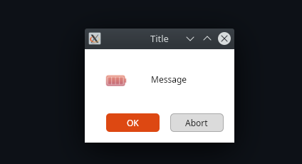
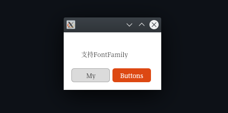

# MessageBox.Avalonia

Messagebox for AvaloniaUI
for 0.10


To start you should install MessageBox.Avalonia NuGet package 
>   dotnet add package MessageBox.Avalonia 

[](https://www.nuget.org/packages/MessageBox.Avalonia/0.10.0)
or download this repo.

[](https://github.com/CreateLab/MessageBox.Avalonia/wiki) - here you can find the API.

The easiest way to get started is this:

---
# Update
We remove dependency from ReactiveUI, that mean, that you may use this lib with mvc or no reactiveui projects

---


```cs 
var messageBoxStandardWindow = MessageBox.Avalonia.MessageBoxManager
  .GetMessageBoxStandardWindow("title", "Lorem ipsum dolor sit amet, consectetur adipiscing elit, sed...");
messageBoxStandardWindow.Show();
```

Or this, with default buttons from the default `ButtonEnum`:



```cs
var msBoxStandardWindow = MessageBox.Avalonia.MessageBoxManager
    .GetMessageBoxStandardWindow(new MessageBoxStandardParams{
        ButtonDefinitions = ButtonEnum.OkAbort,
        ContentTitle = "Title",
        ContentMessage = "Message",
        Icon = Icon.Plus,
        Style = Style.UbuntuLinux
    });
msBoxStandardWindow.Show();
```

Or like this, with custom buttons:



```cs
var messageBoxCustomWindow = MessageBox.Avalonia.MessageBoxManager
    .GetMessageBoxCustomWindow(new MessageBoxCustomParams {
        Style = Style.UbuntuLinux,
        ContentMessage = "Message",
        ButtonDefinitions = new [] {
            new ButtonDefinition {Name = "My"},
            new ButtonDefinition {Name = "Buttons", Type = ButtonType.Colored}
        }
    });
messageBoxCustomWindow.Show();
```
Also you may use hyperlink boxes.


```cs
 var messageBoxCustomWindow = MessageBox.Avalonia.MessageBoxManager.GetMessageBoxHyperlinkWindow(new MessageBoxHyperlinkParams()
            {
                CanResize = true,
                Style = MessageBoxAvaloniaEnums.Style.MacOs,
                HyperlinkContentProvider = new[]{
                    new HyperlinkContent { Alias = "dedede         ", Url = "https://avaloniaui.net/docs/styles/styles" },
                    new HyperlinkContent { Alias="edvyydebbvydebvyed         "},
                    new HyperlinkContent { Url= "https://avaloniaui.net/docs/styles/styles" }
                },
                WindowStartupLocation = WindowStartupLocation.CenterScreen,
                ButtonDefinitions = MessageBoxAvaloniaEnums.ButtonEnum.Ok
            });
messageBoxCustomWindow.Show();
```

**Powered by**

<a href="https://www.jetbrains.com/?from=ABC">

</a>

**Usages:**

[Lacmus](https://github.com/lizaalert/lacmus)

[SQRLDotNetClient](https://github.com/sqrldev/SQRLDotNetClient)

[OpenTabletDriver](https://github.com/InfinityGhost/OpenTabletDriver/tree/c4d823a11824abec3fb0f6d4f7182610aba5c9d8)

[Comquiz](https://github.com/VFansss/comquiz)
